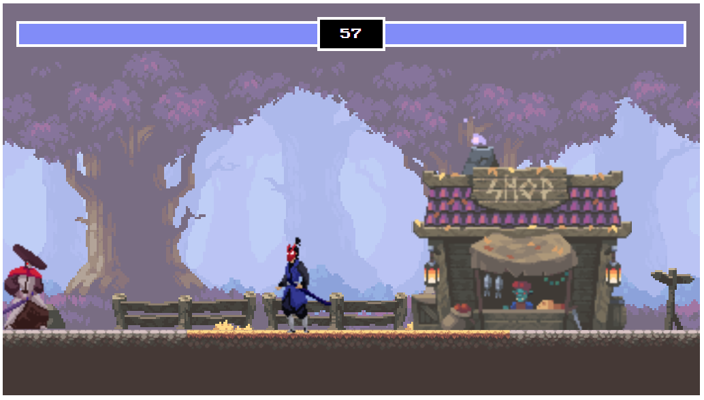

# FIGHTING GAME 
## Description
A fighting game run entirely within browser, on HTML, CSS and JavaScript. [You can play it by clicking here!](https://rookieprime.github.io/fighting-game/)

## Table of Contents
- [Questions](#Questions)
- [Code-of-Conduct](#Code-of-Conduct)
- [License](#License)

## Questions
If you need to reach me, my GitHub username (and a link to my profile page) is [RookiePrime](https://github.com/RookiePrime) and my email address is [kiefer.levine@protonmail.com](mailto:kiefer.levine@protonmail.com).

### Frequently Asked Questions
#### What technologies did you use to create this game?
This game runs almost entirely on core ES6 libraries. The animation of the healthbars, however, is the result of the package gsap. Thanks, gsap!
#### Did you come up with this yourself?
Nope! I followed a tutorial on YouTube, which you can watch here: https://www.youtube.com/watch?v=vyqbNFMDRGQ. I made my own adjustments, however, such as utilizing a CSS stylesheet, modifying the damage output of the fighters, and preventing the player from jumping while airborne.

## Code-of-Conduct
### Contributor Covenant
We as members, contributors, and leaders pledge to make participation in our
community a harassment-free experience for everyone, regardless of age, body
size, visible or invisible disability, ethnicity, sex characteristics, gender
identity and expression, level of experience, education, socio-economic status,
nationality, personal appearance, race, caste, color, religion, or sexual identity
and orientation.

We pledge to act and interact in ways that contribute to an open, welcoming,
diverse, inclusive, and healthy community.
[Click here to read the full code of conduct](https://www.contributor-covenant.org/version/2/0/code_of_conduct/)

## License
This software is offered under the MIT License. For more information on conditions of use, [follow this link.](https://opensource.org/licenses/MIT).